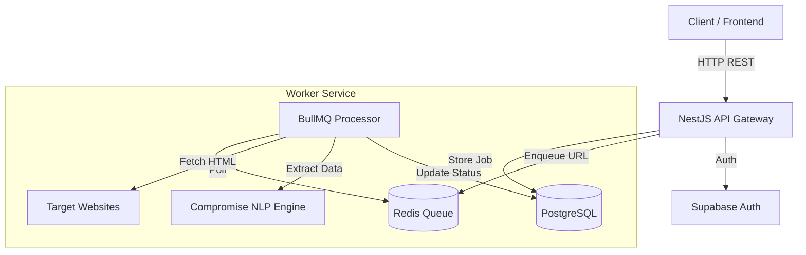

# Company Data Extractor - Backend

A high-performance, scalable, and intelligent web scraping backend service built with **NestJS**. This system is designed to extract structured company data (name, website, industry, headcount, location, contacts) from unstructured web pages using a multi-layered extraction strategy including Natural Language Processing (NLP).

---

## 📚 Table of Contents

- [Architecture](#-architecture)
  - [System Overview](#system-overview)
  - [Data Flow](#-data-flow)
  - [Component Design](#-component-design)
- [Features](#-features)
- [Tech Stack](#-tech-stack)
- [Database Schema](#-database-schema)
- [Getting Started](#-getting-started)
  - [Prerequisites](#prerequisites)
  - [Installation](#installation)
  - [Configuration](#configuration)
  - [Running the Application](#running-the-application)
- [API Reference](#-api-reference)
- [Monitoring & Observability](#-monitoring--observability)
- [Testing](#-testing)

---

## 🏗 Architecture

### System Overview

The application follows a **microservices-ready modular architecture** using NestJS. It leverages an asynchronous worker pattern to handle heavy scraping tasks without blocking the main API thread.



### 🔄 Data Flow

1.  **Job Submission**:
    -   Client uploads a file containing URLs or requests a mock scrape.
    -   **Auth Guard** verifies the user via Supabase.
    -   **ScrapingService** creates a `Job` record in PostgreSQL with status `pending`.
    -   URLs are parsed, validated, and converted into `ScrapingItem` records.

2.  **Queueing**:
    -   Each URL is individually enqueued into the **BullMQ** `scrape-queue` backed by **Redis**.
    -   Jobs are configured with **exponential backoff** (3 retries, 2s delay) to handle transient network failures.

3.  **Processing (The Worker)**:
    -   **ScrapingProcessor** picks up a job (concurrency: 20).
    -   **Rate Limiter** applies a configurable delay (`REQUEST_DELAY_MS`) to respect target server limits.
    -   **Fetcher** retrieves HTML using `axios` with a custom `User-Agent` and connection pooling (`httpAgent`/`httpsAgent`).

4.  **Intelligent Extraction**:
    The system uses a **Waterfall Strategy** to extract data:
    -   **Layer 1 (Structured)**: CSS Selectors (`cheerio`) target common patterns (e.g., `h1.company-name`, `.contact-card`).
    -   **Layer 2 (Metadata)**: Fallback to Meta tags, OpenGraph, and JSON-LD data.
    -   **Layer 3 (NLP)**: If structured data is missing, the **Compromise** NLP engine analyzes the raw text to identify Organizations (`#Organization`), Locations (`#Place`), and People (`#Person`).

5.  **Persistence**:
    -   Extracted data is normalized and saved to the `scraping_items` table.
    -   Job progress (`processedUrls`, `failedUrls`) is updated atomically.

### 🧩 Component Design

#### 1. API Module (`src/modules/scraping`)
-   **Controller**: Handles HTTP requests, file uploads (Multer), and input validation (DTOs).
-   **Service**: Orchestrates the flow between the database and the queue.
-   **Queue Service**: Wraps BullMQ interactions, providing typed interfaces for adding jobs.

#### 2. Worker Module (`src/modules/scraping/processors`)
-   **ScrapingProcessor**: A dedicated class decorated with `@Processor('scrape-queue')`.
-   **Isolation**: Runs in the same process as the API (for simplicity) but can be easily split into a standalone microservice.
-   **Resilience**: Handles timeouts, DNS errors, and HTTP 4xx/5xx responses gracefully.

#### 3. Authentication Module (`src/modules/auth`)
-   **Supabase Integration**: Uses the Supabase JS client to handle login/signup.
-   **User Sync**: Automatically synchronizes Supabase `auth.users` with a local `public.users` table to maintain referential integrity for jobs.

---

## 🚀 Features

-   **High-Performance Scraping**:
    -   **Parallel Processing**: Process up to 20 URLs simultaneously (configurable).
    -   **Connection Pooling**: Reuses TCP connections to reduce overhead.
    -   **Gzip/Brotli Support**: Automatically handles compressed responses.
-   **Smart Data Extraction**:
    -   Extracts **Company Name**, **Website**, **Industry**, **Headcount**, **Location**.
    -   Identifies **Contacts** (Name, Title, Email) using pattern matching and NLP.
-   **Robust Error Handling**:
    -   Automatic retries for failed requests.
    -   Detailed error logging (stack traces, request IDs).
    -   Graceful degradation (partial data is better than no data).
-   **Security**:
    -   JWT-based authentication.
    -   Input validation using `class-validator` and `Joi`.
    -   CORS configuration for production security.

---

## 🛠 Tech Stack

| Category | Technology | Purpose |
|----------|------------|---------|
| **Framework** | [NestJS](https://nestjs.com/) | Modular backend architecture |
| **Language** | [TypeScript](https://www.typescriptlang.org/) | Type safety and modern JS features |
| **Database** | [PostgreSQL](https://www.postgresql.org/) | Relational data storage |
| **ORM** | [Drizzle ORM](https://orm.drizzle.team/) | Lightweight, type-safe SQL builder |
| **Auth** | [Supabase](https://supabase.com/) | Authentication & User Management |
| **Queue** | [BullMQ](https://docs.bullmq.io/) | Redis-based job queue |
| **Cache** | [Redis](https://redis.io/) | Queue backing store |
| **Scraping** | [Cheerio](https://cheerio.js.org/) | Fast HTML parsing (jQuery-like) |
| **HTTP** | [Axios](https://axios-http.com/) | Promise-based HTTP client |
| **NLP** | [Compromise](https://github.com/spencermountain/compromise) | Lightweight NLP for entity extraction |
| **Docs** | [Swagger](https://swagger.io/) | API Documentation |

---

## 🗄 Database Schema

The project uses a relational schema optimized for job tracking.

### `users`
-   `id`: UUID (Primary Key, syncs with Supabase)
-   `email`: String (Unique)
-   `is_email_verified`: Boolean

### `scraping_jobs`
-   `id`: UUID (Primary Key)
-   `user_id`: UUID (Foreign Key -> users.id)
-   `status`: Enum (`pending`, `processing`, `completed`, `failed`)
-   `total_urls`: Integer
-   `processed_urls`: Integer
-   `failed_urls`: Integer

### `scraping_items`
-   `id`: UUID (Primary Key)
-   `job_id`: UUID (Foreign Key -> scraping_jobs.id)
-   `url`: String
-   `status`: Enum (`pending`, `processing`, `completed`, `failed`)
-   `company_name`, `industry`, `headcount_range`, `hq_location`: Strings
-   `contacts`: JSONB (Array of contact objects)
-   `raw_data`: JSONB (Metadata like scrape time, HTML length)

---

## 🏁 Getting Started

### Prerequisites

-   **Node.js**: v18 or higher
-   **Docker**: For running Redis locally
-   **Supabase Account**: For database and authentication

### Installation

1.  **Clone the repository**
    ```bash
    git clone <repository-url>
    cd company-data-extractor/backend
    ```

2.  **Install dependencies**
    ```bash
    npm install
    ```

### Configuration

Create a `.env` file in the root directory:

```bash
cp env.example.txt .env
```

**Key Environment Variables:**

| Variable | Description | Default |
|----------|-------------|---------|
| `PORT` | API Port | `3000` |
| `DATABASE_URL` | PostgreSQL Connection String | - |
| `SUPABASE_URL` | Supabase Project URL | - |
| `SUPABASE_ANON_KEY` | Supabase Anon Key | - |
| `REDIS_HOST` | Redis Hostname | `localhost` |
| `REDIS_PORT` | Redis Port | `6380` |
| `REQUEST_DELAY_MS` | Delay between scrape requests | `500` |
| `MOCK_COMPANY_DATA_SERVER_URL` | URL for mock scraping | - |

### Running the Application

1.  **Start Infrastructure (Redis)**
    ```bash
    npm run docker:up
    ```

2.  **Push Database Schema**
    ```bash
    npm run db:push
    ```

3.  **Start Development Server**
    ```bash
    npm run start:dev
    # OR with Docker auto-start
    npm run start:dev:docker
    ```

---

## 📖 API Reference

The API is fully documented using Swagger.

**Access Swagger UI:** `http://localhost:3000/api/docs`

### Core Endpoints

#### Authentication
-   `POST /auth/signup`: Create a new account.
-   `POST /auth/login`: Authenticate and receive JWT.

#### Scraping Jobs
-   `POST /scraping-jobs`: Submit a new job.
    -   **Body (Multipart)**: `file` (txt/csv) OR `useMockServer=true`.
-   `GET /scraping-jobs`: List all jobs for the current user.
-   `GET /scraping-jobs/:id`: Get detailed status and results for a specific job.

#### Scraping Items
-   `GET /scraping-items`: Retrieve flattened list of all scraped items.

---

## 📊 Monitoring & Observability

### Bull Board (Queue UI)
Monitor the status of your scraping queues in real-time.
-   **URL**: `http://localhost:3000/admin/queues`
-   **Features**: View active jobs, retry failed jobs, clean old jobs.

### Logging
The application uses the NestJS `Logger` service with structured context.
-   **Format**: `[Context] Message { metadata }`
-   **Levels**: `LOG`, `ERROR`, `WARN`, `DEBUG`, `VERBOSE`

---

## 🧪 Testing

### Unit Tests
Run unit tests for services and controllers:
```bash
npm run test
```

### End-to-End (E2E) Tests
*Note: The E2E test suite is currently under maintenance.*

---

## 🤝 Contributing

1.  Fork the repository
2.  Create your feature branch (`git checkout -b feature/amazing-feature`)
3.  Commit your changes (`git commit -m 'Add some amazing feature'`)
4.  Push to the branch (`git push origin feature/amazing-feature`)
5.  Open a Pull Request